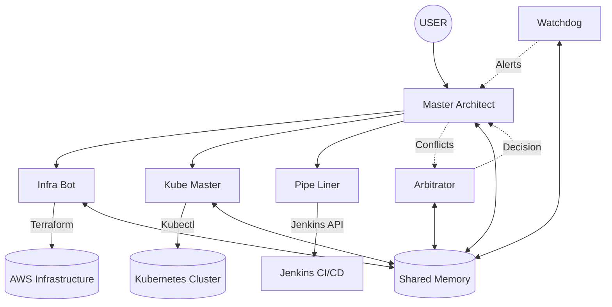

# DevOps Multi-Agent Ecosystem Map

This document maps the relationships between Workflows, Personas, and Skills within the ecosystem.

## 🗺️ High-Level Interaction Map

---

## 🔄 Workflow Analysis

### 1. `/deploy-full-stack`
**Orchestrator:** @Master-Architect
**Description:** End-to-End provisioning from Terraform to Kubernetes.

| Step | Persona | Skill Used | Tools |
|:---|:---|:---|:---|
| Plan Infra | @Infra-Bot | `terraform-plan` | `terraform plan` |
| Apply Infra | @Infra-Bot | `terraform-sync` | `terraform apply` |
| **Approval** | @Master-Architect | `approval-gate` | *Manual Review* |
| K8s Deploy | @Kube-Master | `k8s-troubleshoot` | `kubectl apply` |
| Verification | @Master-Architect | `system-check` | `curl`, `kubectl get` |

### 2. `/daily-health-check`
**Orchestrator:** @Watchdog (Autonomous) or @Master-Architect (Manual)
**Description:** System-wide health monitoring.

| Step | Persona | Skill Used | Tools |
|:---|:---|:---|:---|
| Check Infra | @Infra-Bot | `system-check` | `terraform output` |
| Check K8s | @Watchdog | `system-check` | `mcp_k8s_pods_list` |
| Check CI/CD | @Pipe-Liner | `jenkins-ops` | `mcp_jenkins_getStatus` |
| **Logic** | @Watchdog | *Internal Logic* | *Memory Read/Write* |

### 3. `/github-ops`
**Orchestrator:** @Master-Architect
**Description:** Repository management and code reviews.

| Step | Persona | Skill Used | Tools |
|:---|:---|:---|:---|
| PR Review | @Master-Architect | `mcp-github-flow` | `mcp_github_...` |
| Merge | @Master-Architect | `mcp-github-flow` | `mcp_github_merge` |

### 4. `/security-audit`
**Orchestrator:** @Master-Architect (delegates to specialists)
**Description:** Security compliance scan.

| Step | Persona | Skill Used | Tools |
|:---|:---|:---|:---|
| Infra Scan | @Infra-Bot | `security-audit` | `terraform plan` |
| K8s Scan | @Kube-Master | `security-audit` | `kubectl auth can-i` |
| **Conflict** | @Arbitrator | *Priority Matrix* | *Decision Log* |

---

## 👥 Persona Capability Matrix

| Persona | Role | Core Skills | Exclusive Access |
|:---|:---|:---|:---|
| **@Master-Architect** | Orchestrator | `approval-gate`, `mcp-github-flow` | Decision Making, All Logs |
| **@Infra-Bot** | IaC Specialist | `terraform-plan`, `terraform-sync` | Terraform State |
| **@Kube-Master** | K8s Operator | `k8s-troubleshoot` | `kubectl` (Write) |
| **@Pipe-Liner** | CI/CD Engineer | `jenkins-ops` | Jenkins Admin |
| **@Watchdog** | Monitor | `system-check` | *None (Read Only)* |
| **@Arbitrator** | Judge | *None (Logic Only)* | *None (Logic Only)* |

---

## 🛠️ Skill Utilization Gap Analysis

### ✅ Well-Used Skills
- `terraform-plan` (Used in 3 workflows)
- `k8s-troubleshoot` (Used in 2 workflows + ad-hoc)
- `system-check` (Used by Watchdog daily)

### ⚠️ Under-Utilized / Orphaned Skills
- `mcp-fetch-docs`: Assigned to Master Architect but rarely used in defined workflows.
- `infra-bot-reader`: Appears as a persona but might be redundant if `Infra-Bot` handles reads.

### 🧩 Missing Workflows
- **Incident Response:** No specific workflow for when `@Watchdog` triggers a Critical Alert.
- **Cost Optimization:** `@Infra-Bot` has cost responsibility but no workflow to execute it.

---

## 💡 Recommendations

1.  **Consolidate Reader Personas:** Remove `@Infra-Bot-Reader` if `@Infra-Bot` can safely handle read-only "plan" operations (it can).
2.  **Create Incident Response Workflow:** Define `/incident-response` triggered by Watchdog Level 2/3 alerts.
3.  **Formalize Cost Workflow:** Create `/cost-audit` for unused resource cleanup.
